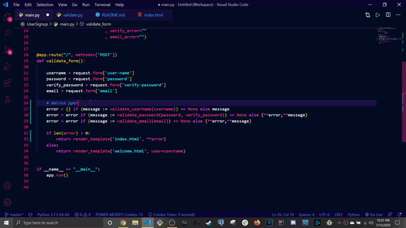
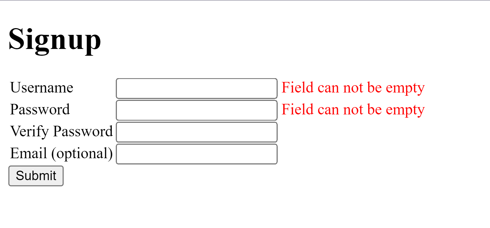
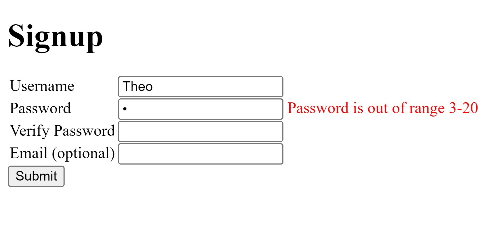
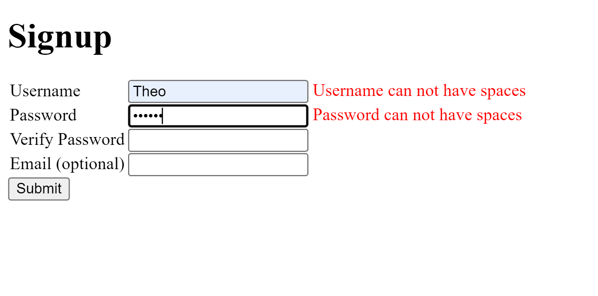
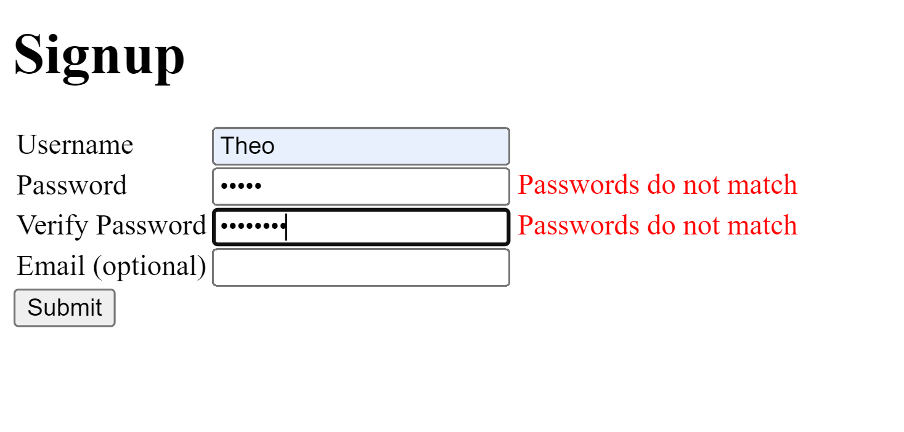
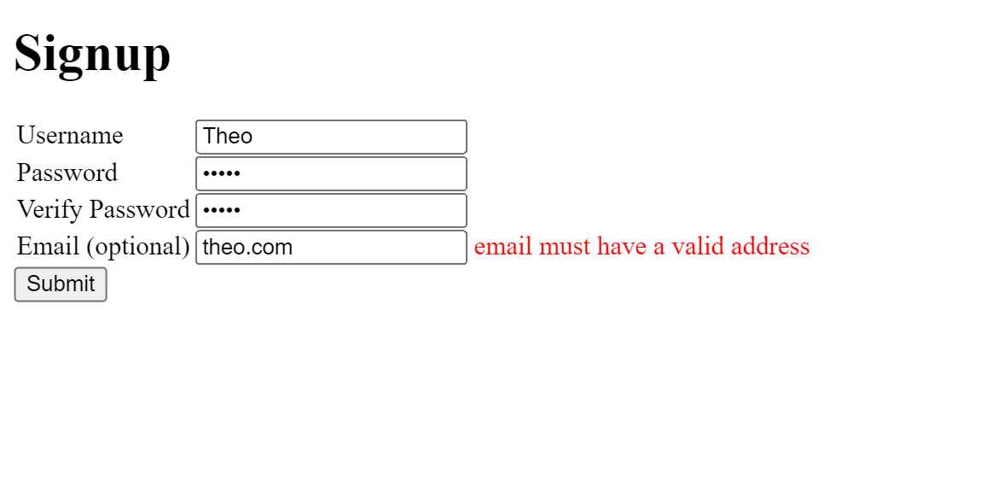

# User Signup

An HTML form and welcome page with backend user validation via Python Flask. Updated to utilize walrus operators, ternary operators, and Dictionary interactions. Preview screenshots of the form and results from the error handling can be found below.

*This script was a homework assignment at LaunchCode's Lc101 (2018)*

# Fun refactoring

# Empty fields

# Password out of range

# Illegal whitespace

# Passwords do not match

# Invalid email

# All fields are valid

